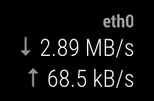

# EdgeRouter Throughput

A MagicMirror² Module to show the interface throughput of an Ubiquity EdgeRouter.

The Module uses SSH to connect to the router and reads the network throughput from `/sbin/ifstat`.

## Installation

1. Clone the Repo into your MagicMirror modules folder `git clone git@github.com:mscharl/MMM-edgerouter-throughput.git`
2. Install some node dependencies `cd MMM-edgerouter-throughput && npm install --production`
3. [Configure](#configuration) and enjoy

## Configuration

| Property            | Type      | Required | Default     | Description                                          |
| ------------------- | --------- | :------: | ----------- | ---------------------------------------------------- |
| `gateway`           | `string`  |    ✔︎     |             | The IP Address of your EdgeRouter                    |
| `port`              | `number`  |          |             | The SSH port your EdgeRouter listens on (22 default) |
| `username`          | `string`  |    ✔︎     |             | The username of your EdgeRouter with SSH access.     |
| `password`          | `string`  |    ✔︎     |             | The password of your EdgeRouter with SSH access.     |
| `interface`         | `string`  |    ✔︎     |             | The interface to display on the mirror.              |
| `title`             | `string`  |          | `undefined` | An optional title to display on the mirror.          |
| `showInterfaceName` | `boolean` |          | `false`     | Whether to show the name of the interface or not.    |

## Compatibility

I developed this module based on my EdgeRouter X with nothing additionally installed.

I can't guarantee that it will work on other devices.
But I guess it should work, as long as it's possible to connect via SSH and the `ifstat` command is available under `/sbin`.  
